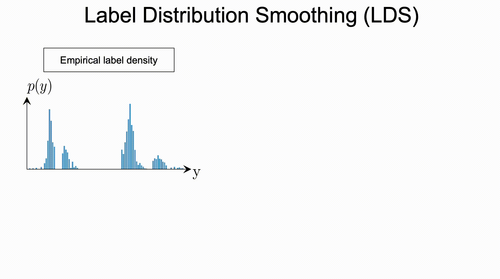
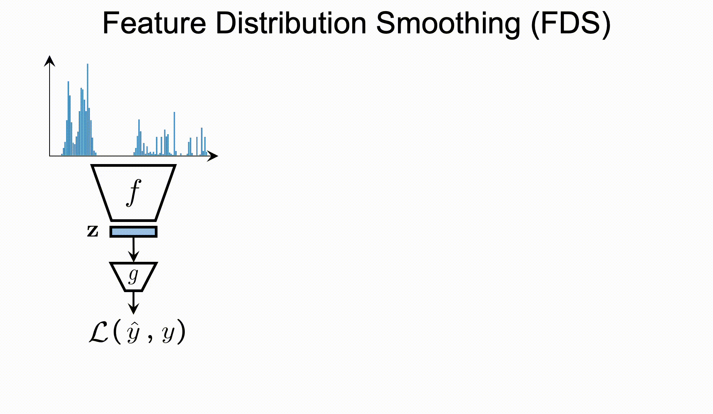
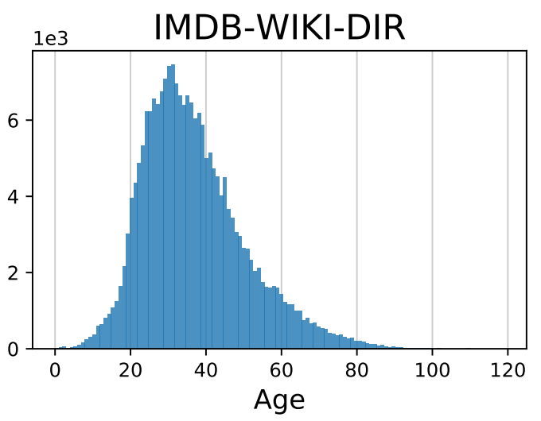
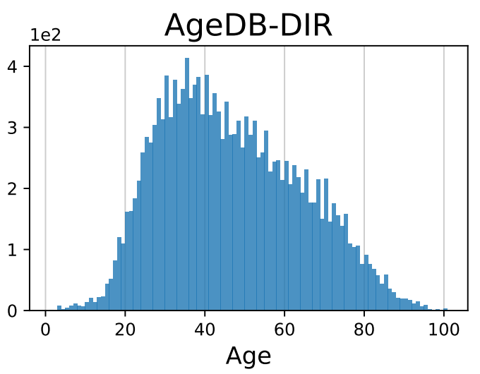
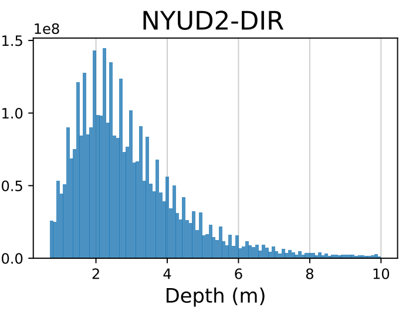
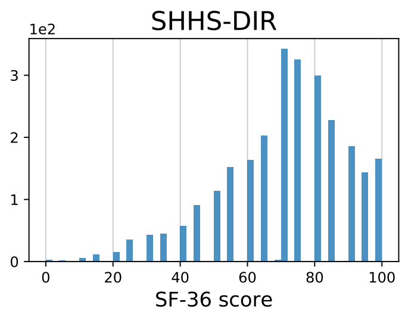

# Delving into Deep Imbalanced Regression

This repository contains the implementation code for paper: <br>
__Delving into Deep Imbalanced Regression__ <br>
[Yuzhe Yang](http://www.mit.edu/~yuzhe/), [Kaiwen Zha](https://kaiwenzha.github.io/), [Ying-Cong Chen](https://yingcong.github.io/), [Hao Wang](http://www.wanghao.in/), [Dina Katabi](https://people.csail.mit.edu/dina/) <br>
_38th International Conference on Machine Learning (ICML 2021), **Long Oral**_ <br>
[[Project Page](http://dir.csail.mit.edu/)] [[Paper](https://arxiv.org/abs/2102.09554)] [[Video](https://youtu.be/grJGixofQRU)] [[Blog Post](https://towardsdatascience.com/strategies-and-tactics-for-regression-on-imbalanced-data-61eeb0921fca)] [](https://colab.research.google.com/github/YyzHarry/imbalanced-regression/blob/master/tutorial/tutorial.ipynb)

<p align="center">
     <br>
<b>Deep Imbalanced Regression (DIR)</b> aims to learn from imbalanced data with continuous targets, <br> tackle potential missing data for certain regions, and generalize to the entire target range.
</p>


## Beyond Imbalanced Classification: Brief Introduction for DIR
Existing techniques for learning from imbalanced data focus on targets with __categorical__ indices, i.e., the targets are different classes. However, many real-world tasks involve __continuous__ and even infinite target values. We systematically investigate _Deep Imbalanced Regression (DIR)_, which aims to learn continuous targets from natural imbalanced data, deal with potential missing data for certain target values, and generalize to the entire target range.

We curate and benchmark large-scale DIR datasets for common real-world tasks in _computer vision_, _natural language processing_, and _healthcare_ domains, ranging from single-value prediction such as age, text similarity score, health condition score, to dense-value prediction such as depth.


## Usage
We separate the codebase for different datasets into different subfolders. Please go into the subfolders for more information (e.g., installation, dataset preparation, training, evaluation & models).

#### __[IMDB-WIKI-DIR](https://github.com/YyzHarry/imbalanced-regression/tree/main/imdb-wiki-dir)__ &nbsp;|&nbsp; __[AgeDB-DIR](https://github.com/YyzHarry/imbalanced-regression/tree/main/agedb-dir)__ &nbsp;|&nbsp; __[NYUD2-DIR](https://github.com/YyzHarry/imbalanced-regression/tree/main/nyud2-dir)__ &nbsp;|&nbsp; __[STS-B-DIR](https://github.com/YyzHarry/imbalanced-regression/tree/main/sts-b-dir)__


## Highlights
__(1) :heavy_check_mark: New Task:__ Deep Imbalanced Regression (DIR)

__(2) :heavy_check_mark: New Techniques:__

|  |  |
| :-: | :-: |
| Label distribution smoothing (LDS) | Feature distribution smoothing (FDS) |

__(3) :heavy_check_mark: New Benchmarks:__ <br>
- _Computer Vision:_ :bulb: IMDB-WIKI-DIR (age) / AgeDB-DIR (age) / NYUD2-DIR (depth)
- _Natural Language Processing:_ :clipboard: STS-B-DIR (text similarity score)
- _Healthcare:_ :hospital: SHHS-DIR (health condition score)

| [IMDB-WIKI-DIR](https://github.com/YyzHarry/imbalanced-regression/tree/main/imdb-wiki-dir) | [AgeDB-DIR](https://github.com/YyzHarry/imbalanced-regression/tree/main/agedb-dir) | [NYUD2-DIR](https://github.com/YyzHarry/imbalanced-regression/tree/main/nyud2-dir) | [STS-B-DIR](https://github.com/YyzHarry/imbalanced-regression/tree/main/sts-b-dir) | SHHS-DIR |
| :-: | :-: | :-: | :-: | :-: |
|  |  |  |  |  |


## Updates
- [06/2021] We provide a [hands-on tutorial](https://github.com/YyzHarry/imbalanced-regression/tree/main/tutorial) of DIR. Check it out! [](https://colab.research.google.com/github/YyzHarry/imbalanced-regression/blob/master/tutorial/tutorial.ipynb)
- [05/2021] We create a [Blog post](https://towardsdatascience.com/strategies-and-tactics-for-regression-on-imbalanced-data-61eeb0921fca) for this work (version in Chinese is also available [here](https://zhuanlan.zhihu.com/p/369627086)). Check it out for more details!
- [05/2021] Paper accepted to ICML 2021 as a __Long Talk__. We have released the code and models. You can find all reproduced checkpoints via [this link](https://drive.google.com/drive/folders/1UfFJNIG-LPOMecwi1tfYzEViBiAYhNU0?usp=sharing), or go into each subfolder for models for each dataset.
- [02/2021] [arXiv version](https://arxiv.org/abs/2102.09554) posted. Please stay tuned for updates.


## Citation
If you find this code or idea useful, please cite our work:
```bib
@inproceedings{yang2021delving,
  title={Delving into Deep Imbalanced Regression},
  author={Yang, Yuzhe and Zha, Kaiwen and Chen, Ying-Cong and Wang, Hao and Katabi, Dina},
  booktitle={International Conference on Machine Learning (ICML)},
  year={2021}
}
```


## Contact
If you have any questions, feel free to contact us through email (yuzhe@mit.edu & kzha@mit.edu) or Github issues. Enjoy!
